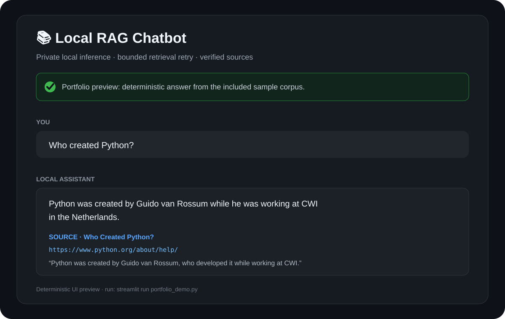
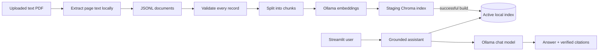
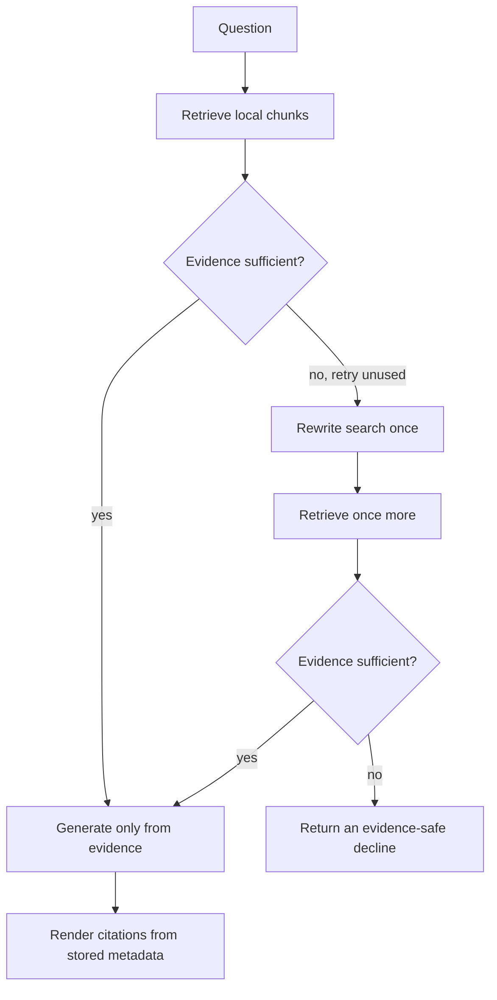

# Local Agentic RAG with Ollama

[](https://github.com/akrambelajouza/local-agentic-rag-with-ollama/actions/workflows/quality.yml)
[](https://github.com/akrambelajouza/local-agentic-rag-with-ollama/releases/tag/v1.0.0)
[](https://www.python.org/)
[](LICENSE)

A local-first retrieval-augmented generation (RAG) application that answers
questions from your documents, shows the supporting excerpts, and declines when
the evidence is insufficient. Ollama runs both models on your machine and Chroma
stores the index locally, so documents and prompts do not need to leave the host.

The project demonstrates more than a happy-path chatbot: safe index replacement,
startup diagnostics, bounded agentic query retry, source verification, an evaluation
harness, a tested Streamlit interface, and cross-platform CI.

## Grounded-answer demo



This is a deterministic preview built from `datasets/data.txt`, not a claimed live
model run. Reproduce the read-only UI preview without Ollama:

```bash
streamlit run portfolio_demo.py
```

The production application uses the same presentation but generates answers from
the locally retrieved chunks.

## Architecture



Ingestion builds in an isolated directory and replaces the active index only after
the complete build succeeds. Model names, chunk settings, paths, retrieval limits,
and thresholds come from `.env`.

## Agent flow



The retry is deliberately bounded to one rewrite. A similarity score can never
override an insufficient-evidence decision. The UI reports workflow events without
exposing hidden model reasoning, and citation URLs come from retrieval metadata rather
than model-generated text.

## Quick start

Prerequisites: Git, Python 3.11 or 3.12, and
[Ollama](https://ollama.com/download). Commands below use the repository's pinned
dependency set.

```bash
git clone https://github.com/akrambelajouza/local-agentic-rag-with-ollama.git
cd local-agentic-rag-with-ollama
python -m venv venv
```

Activate and configure on Windows PowerShell:

```powershell
.\venv\Scripts\Activate.ps1
python -m pip install -r requirements.lock
Copy-Item .env.example .env
```

Activate and configure on macOS/Linux:

```bash
source venv/bin/activate
python -m pip install -r requirements.lock
cp .env.example .env
```

Install the configured local models, verify prerequisites, build the index, and
start the app:

```bash
ollama pull mxbai-embed-large
ollama pull llama3.2:3b
python -m local_rag.readiness
python -m local_rag.ingestion
python -m local_rag.readiness
streamlit run app.py
```

Readiness must report that configuration, corpus, Ollama, both models, and the
vector collection are available. The first readiness run may report the collection
as missing; ingestion creates it.

### Upload PDF documents

Open the production app and use **Add PDF documents**. Upload one or more text-based PDFs,
then select **Ingest PDFs**. Each file is limited to 20 MB. The app extracts non-empty
pages locally, appends them to `datasets/data.txt`, and performs the same atomic full
index rebuild used by the CLI. Existing JSONL documents remain in the corpus, and an
identical PDF upload is skipped without rebuilding.

Each extracted page receives a stable `local-pdf://` source containing the file hash,
filename, and page number. The original PDF is not retained after extraction. Scanned
PDFs require OCR before upload, and password-protected PDFs must first be unlocked.
If extraction or indexing fails, the previous JSONL corpus and Chroma index are restored.

## Reproducible examples and evaluation

The included Python corpus and `evaluation/questions.jsonl` make these scenarios
repeatable:

- `Who created Python?` → answer includes Guido van Rossum and a python.org source.
- `Why is the language called Python?` → answer cites the Monty Python origin.
- `How is Python used for web development, data science, and automation?` → answer covers all three areas.
- `What is the capital of France?` → the assistant declines because the corpus lacks evidence.

Run the offline evaluator reference fixture (no Ollama required):

```bash
python -m local_rag.reference_evaluation
```

The committed [reference summary](evaluation/results/reference.md) reports 100% for
retrieval hit rate, answer correctness, and annotated-source coverage, with zero
unsupported claims. Those numbers validate evaluator wiring against known observations;
they are not presented as model-quality results.

The release [live v1.0.0 summary](evaluation/results/v1.0.0.md) and
[machine report](evaluation/results/v1.0.0.json) record a real Windows CPU run with
`llama3.2:3b` and `mxbai-embed-large`: all six cases passed, including the two
out-of-corpus decline cases. See the [release validation record](docs/release-validation.md)
for the clean-install procedure and platform scope.

After indexing the corpus, run the real local models and write a timestamped report:

```bash
python -m local_rag.evaluation_cli --output evaluation/results/latest.json
```

Default thresholds are 75% retrieval hit rate, 75% answer correctness, 0%
unsupported-claim cases, and 75% annotated-source coverage. The command returns a
failing exit status when a threshold is missed and records source revision, Ollama/model
digests, and non-secret runtime configuration for comparison.

## Engineering choices and tradeoffs

| Choice | Benefit | Tradeoff |
| --- | --- | --- |
| Ollama | Private, offline-capable inference | Local model quality and speed depend on hardware |
| Chroma | Simple persistent vector search | A single-host store is not a distributed production database |
| Structured sufficiency judge | Makes retry/decline behavior testable | Adds a model call before generation |
| One retry maximum | Prevents loops, latency spikes, and hidden cost | A second rewrite strategy may sometimes recover more answers |
| Two-stage claim grading | Confirms proposed unsupported claims semantically | Adds local inference latency during evaluation |
| Metadata-derived citations | Prevents invented source URLs | Correctness still depends on retrieval and chunk quality |
| Atomic full rebuild | Keeps the last valid index on failure | Requires temporary disk space during ingestion |
| Page-level PDF extraction | Makes local uploads immediately queryable with page citations | Original files are not retained and OCR is not included |

## Quality checks

Install the pinned development tools and run the same gate as CI:

```bash
python -m pip install -r requirements-dev.lock
python scripts/quality.py
```

The gate runs formatting, linting, 60+ unit/UI tests, branch coverage with an 85%
floor, and dependency consistency. GitHub Actions executes it on Windows and Ubuntu
with Python 3.11 and 3.12. Live Ollama is intentionally opt-in:

```powershell
$env:RUN_LIVE_OLLAMA="1"
python -m unittest tests.test_live_ollama -v
```

```bash
RUN_LIVE_OLLAMA=1 python -m unittest tests.test_live_ollama -v
```

Useful individual commands:

```bash
python -m ruff format --check .
python -m ruff check .
python -m unittest discover -v
python -m unittest tests.test_app -v
python -m coverage run -m unittest discover -v
python -m coverage report
python -m pip check
```

## Limitations and future work

- The default sample is small and English-only; production use needs representative
  documents and a broader evaluation set.
- Evaluation quality varies with local model version and hardware.
- Chroma is local and single-user; there is no authentication or multi-tenant layer.
- Supported input is JSONL and text-based PDF. HTML parsing, OCR, document deletion,
  and incremental index updates remain future work.
- Retrieval currently uses dense similarity only. Hybrid search and reranking could
  improve difficult corpora.
- The UI is synchronous and optimized for a local demonstration, not concurrent load.

## Troubleshooting

| Symptom | Resolution |
| --- | --- |
| `Cannot reach http://localhost:11434` | Start Ollama (`ollama serve`) and confirm `OLLAMA_BASE_URL`. |
| A configured model is missing | Run `ollama pull mxbai-embed-large` and `ollama pull llama3.2:3b`. |
| Collection is missing or empty | Run `python -m local_rag.ingestion`, then readiness again. |
| A PDF reports no extractable text | Run OCR on the document, then upload the resulting searchable PDF. |
| A PDF is password-protected or too large | Unlock it or reduce it below the 20 MB per-file limit before retrying. |
| Configuration is invalid | Copy `.env.example` to `.env`; keep `CHUNK_OVERLAP < CHUNK_SIZE`. |
| An answer is declined | Lowering the threshold may reduce precision; first inspect whether the corpus actually contains the answer. |
| A rebuild fails | The prior active index remains intact; correct the dataset/model issue and rerun ingestion. |

## Project map

```text
local_rag/                 application, retrieval, workflow, JSONL/PDF ingestion, evaluation
datasets/data.txt          included JSONL sample corpus
evaluation/questions.jsonl curated answerable and unanswerable cases
portfolio_demo.py          deterministic read-only portfolio preview
tests/                     unit, Streamlit, ingestion-safety, and opt-in live tests
scripts/quality.py         local/CI quality gate
```

`1_generate_embedding.py` and `2_start_chatbot.py` remain only as backward-compatible
launchers; new usage should prefer the package commands documented above.

## License

Released under the [MIT License](LICENSE).

## Release

The portfolio-ready
[v1.0.0 release](https://github.com/akrambelajouza/local-agentic-rag-with-ollama/releases/tag/v1.0.0)
is published from the validated merge commit. Its evidence and publication sequence
are recorded in the [release validation record](docs/release-validation.md); see the
[changelog](CHANGELOG.md) for the concise feature summary.
